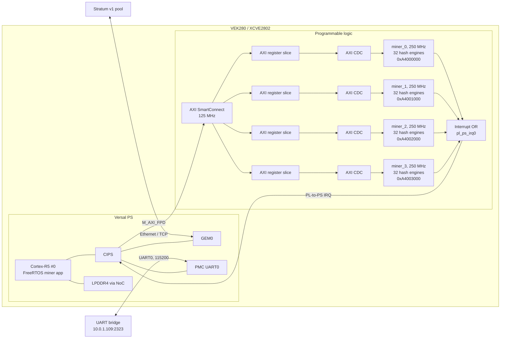

# VEK280 Bitcoin Miner Theory of Operation

## Purpose and current configuration

This design is a Stratum v1 Bitcoin-mining demonstrator for the AMD Versal
Premium VEK280. The implemented configuration has four AXI4-Lite miner
instances, each with 32 nonce-scanning engines, for 128 engines in total. The
miner datapath runs at 250 MHz and the R5 AXI4-Lite control plane runs at
125 MHz. A dedicated AXI clock-domain bridge isolates each miner clock domain
from the control plane.

The current programming image is
`bd/out_vek280_miner_4x32_ooc/miner_system_wrapper.pdi`. The R5 FreeRTOS ELF is
`vitis_ws/vek280_miner_app/build/vek280_miner_app.elf`.

## System partitioning

The R5 handles all protocol and job-management work. It obtains an address with
DHCP, connects to a Stratum v1 server, constructs the 80-byte Bitcoin block
header, calculates the SHA-256 midstate for header bytes 0 through 63, and
programs the PL with the remaining header data and target.

The PL evaluates nonce candidates. It performs the remaining first SHA-256
compression for bytes 64 through 79 plus padding, then the one-block second
SHA-256 compression. Results that are less than or equal to the target are
captured for the R5, which submits them to the pool.

## Hardware architecture



```text
Stratum pool
    |  subscribe / authorize / notify / difficulty
    v
R5 FreeRTOS
    |  coinbase, merkle root, header, midstate, target
    v
Four AXI4-Lite miner instances (32 engines each)
    |  candidate nonce + double-SHA-256 digest
    v
R5 result queue -> mining.submit -> Stratum pool
```

## Nonce processing in the PL

Each engine owns an independent SHA-256 core. The SHA core uses five clock
phases per SHA-256 round, so one 64-round compression takes 320 clocks. A nonce
requires two compressions and an eight-word target comparison. Control handoffs
add a small additional latency, giving a steady-state cost of about 655 PL
clocks per nonce.

Within an AXI instance, the 32 engines divide the assigned range by stride:
engine `i` starts at `nonce_start + i` and advances by 32. The R5 divides the
full job range into four non-overlapping contiguous ranges, one per AXI
instance. Thus all 128 engines together cover the programmed range without
intentional overlap.

At 250 MHz, the estimated raw rate is:

```text
128 engines * 250,000,000 clocks/second / 655 clocks/nonce
    = approximately 48.9 MH/s
```

This is an implementation-derived estimate. Job transitions, queue handling,
and pool activity create brief interruptions; the current hardware does not yet
provide a cycle-accurate hardware hash counter.

## Register access and interrupts

The four miner AXI4-Lite address windows are:

| Instance | Base address | Engines |
| --- | ---: | ---: |
| `miner_0` | `0xA4000000` | 32 |
| `miner_1` | `0xA4001000` | 32 |
| `miner_2` | `0xA4002000` | 32 |
| `miner_3` | `0xA4003000` | 32 |

The R5 writes the midstate, header tail, target, nonce start, and nonce count
to every instance, then sets `CONTROL.start`. Each instance aggregates its
engine results through a clustered FIFO and exposes one result at a time to
software. A PL-to-PS interrupt wakes the R5 miner task, which drains all
available result registers and clears them so the next result can appear.

Important register semantics are:

| Offset | Name | Function |
| ---: | --- | --- |
| `0x000` | `CONTROL` | Start, stop, and clear sticky state/results. |
| `0x004` | `STATUS` | Running, result-valid, nonce-range-done, and overflow status. |
| `0x008` | `NUM_ENGINES` | Read-only engine count. |
| `0x020..0x03c` | `MIDSTATE[0..7]` | SHA-256 state after header bytes 0 through 63. |
| `0x040..0x04c` | `HEADER_TAIL[0..3]` | Header bytes 64 through 79; word 3 is nonce-overridden. |
| `0x060..0x07c` | `TARGET[0..7]` | Big-endian share target. |
| `0x080`, `0x084` | nonce range | First nonce and candidate count. |
| `0x090..0x0bc` | result registers | Candidate nonce, engine, status, and digest. |

## Network and operating control

The R5 application uses GEM Ethernet with DHCP. Its UART is bridged through
`10.0.1.109:2323`; the application also exposes an unauthenticated control
console on TCP port 23 at its DHCP address. The console is intended only for a
trusted lab network.

Useful commands are:

```text
status
regs
stratum
pool <host> <port> <user> [pass]
connect
disconnect
stop
clear
```

`status` reports aggregate miner state, engine count, connection state, and the
most recent candidate result, if any. `regs` reports each AXI instance.
`stratum` reports connection, receive, job, subscription, and authorization
counters.

The firmware currently preserves the latest hardware candidate and submits it
with `mining.submit`, but it does not yet maintain cumulative counters for
candidates found, shares submitted, shares accepted, or shares rejected. Pool
authorization and a received `mining.notify` indicate work delivery, not a
found Bitcoin block.

## Build and load flow

`make vitis-r5` rebuilds the R5 BSP and application for the four-instance XSA.
Vitis 2026.1 uses XSDB Python APIs; XSCT is disabled. The helper scripts are:

```text
software/vitis/load_target.py     # Program PDI, then reset/load/start R5
software/vitis/reload_r5_app.py   # Reset/load/start R5 without changing PL
```

The 4x32 post-route implementation meets its 250 MHz constraints with WNS
`+0.121 ns`, TNS `0.000 ns`, WHS `+0.011 ns`, and THS `0.000 ns`.
